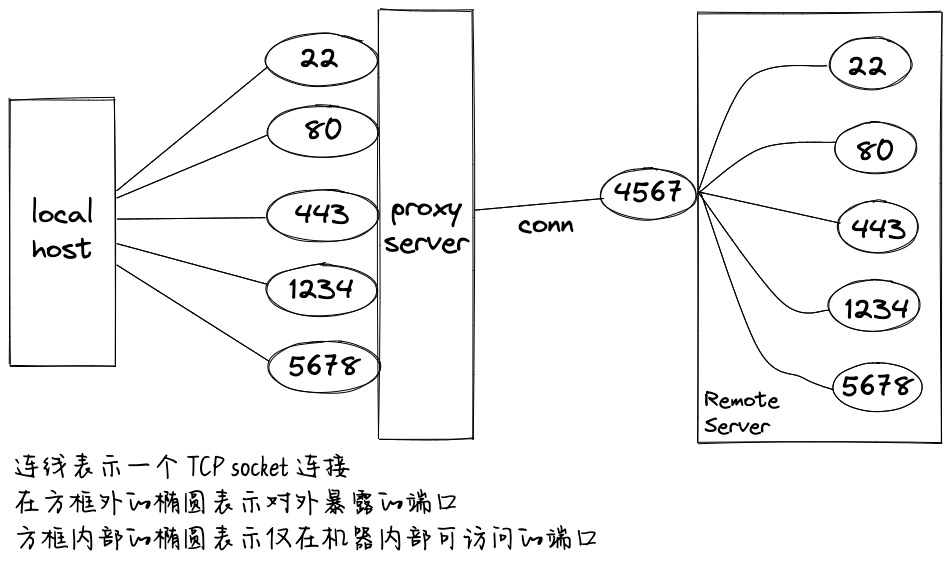

# 网络穿透工具

## 概览



为了完成数据转发, 需要在应用服务器(即有限端口的那台机器, 图中 Remote Server)部署 "远程客户端",
并在本地或者其他可以暴露足够多的端口的机器(图中 Proxy Server)上部署"服务端".
首先启动服务端, 服务端会监听在某个端口, 并等待远程客户端发起连接请求, 随后完成服务端和远程客户端通讯连接建立.
此后, 应用和本机借助这条通道完成数据转发.

### 工作过程

下面描述为一个 echo server 转发数据的工作过程,
比方说 echo server 监听在 Remote Server 的 5678 端口, Proxy Server 配置转发它的 1234 端口数据到 Remote Server 的 5678 端口.

1. Remote Server 向 Proxy Server 发送初始化 Remote Server 指令(`InsInitialRemoteServer`), Proxy Server 收到该指令之后, 会将指令中携带的识别名称和它自己维护的代理端口关联起来.
2. local host 向 Proxy Server 建立到 1234 端口的 TCP 连接.
3. Proxy Server 向 Remote Server 发送连接初始化请求(`InsInitialConnection`), Remote Server 建立到 5678 端口的连接.
4. local host 开始向 Proxy Server 发送数据, 比方发送了 "HelloWorld" 这 10 个字符
5. Proxy Server 的 1234 端口收到后, 将数据通过 Proxy Server 和 Remote Server 之间的 TCP 连接, 向 Remote Server 发送数据转发请求(`InsData`).
6. Remote Server 收到数据后, 将数据发送到 5678 端口.
7. echo server 向 Remote Server 响应 "HelloWorld"
8. Remote Server 通过它和 Proxy Server 之间的数据连接, 请求将 "HelloWorld" 交换(`InsData`)到 1234 那个 TCP 连接.
9. Proxy Server 收到数据之后, 将数据转发给 local host
10. echo server 关闭到 Remote Server 的数据连接.
11. Remote Server 通知 Proxy Server 它到 5678 的连接已经关闭(`InsCloseConnection`).
12. Proxy Server 关闭它到 local host 的连接(即到端口 1234 的那个连接)

### 数据交换协议指令前缀

以上功能依赖 Proxy Server 和 Remote Server 之间的数据交换约定.

在 Proxy Server 和 Remote Server 的数据交互过程中, 每条数据前都加了指令前缀, 用来指示对方完成特定工作内容:

- InsInitialRemoteServer = 0x0000
- InsInitialConnection = 0x0001
- InsHeartbeat = 0x0002
- InsData = 0x0003
- InsCloseConnection = 0x0004

`InsInitialRemoteServer` 是 Remote Server 通知 Proxy Server 希望 Proxy Server 为自己代理数据数据转发, Proxy Server 收到后会保存指令中携带的名称标识, 以后 Proxy Server 收到代理端口发送过来的连接之后, 用这个名称来标识是否应该将数据发送给 Remote Server. 本指令格式如下:

```
16bits(0x0000) + 32bits(name length) + var-len(name)
```

`InsInitialConnection` 是通知对方我有一个新的 sock 连接请求, 希望你那边也建立起到对应转发端口的连接以为接下来的数据交互做准备. 它的格式如下:

```
16bits(0x0001) + 48bits(identity) + 16bits(target port)
```

0x0000 是初始化连接指令, identity 是应用连接标识, 在上面的描述步骤中 local host -> Proxy Server 和 Remote Server -> echo server 这两个连接将会使用一样的标识, 因为如果在没有端口转发的情况下, 他们实际上就是一条连接.

`InsHeartbeat` 是心跳包, 由 Remote Server 发送给 Proxy Server, 心跳包只有 2 字节的指令信息, 没有后续数据:

```
16bits(0x0002)
```

`InsData` 是数据交换指令, 用于将 local host 发送给 Remote Server 的数据转发到 Proxy Server 连接的 echo server, 其格式如下:

```
16bits(0x0003) + 48bits(identity) + 32bits(length) + var-len(data)
```

32bits 的数据长度信息, 后面是对应的数据, 读取对应的字节数即可将该数据包全部读完.

`InsCloseConnection` 是用来指示接收方关闭某条数据连接的指令. 比如说 local host 到 Proxy Server 的连接关闭了, 这时候 Remote Server 到 echo server 的那个连接, 也不再被使用, 就需要关掉. 关闭指令的数据格式如下:

```
16bits(0x0004) + 48bits(identity)
```

## 配置解释

配置分为客户端(Remote Server)/服务端(Proxy Server)两部分:

```yaml
# proxy server 监听在这个地址, 等待 remote server 的连接
bind: 0.0.0.0:9015

proxy:
# 下面这个配置表示, 进入 6688 端口的所有数据, 将会被转发到 remote_client1 远端 17211 这个端口
- remote_name: remote_client1
    port_list:
    - type: http
        bind: 127.0.0.1:6688
        remote: 17211

    - type: tcp # tcp 流量转发
        bind: 127.0.0.1:6689
        remote: 17210

# 下面这个配置表示, 进入 6688 端口的所有数据, 将会被转发到 remote_client2 远端 17211 这个端口
- remote_name: remote_client2
    port_list:
    - type: http
        bind: 127.0.0.1:6678
        remote: 17211

    - type: tcp
        bind: 127.0.0.1:6679
        remote: 17210
```

下面是一个实例 remote server 配置

```yaml
# remote server 的名称, 建立到 proxy server 连接的时候发送给 proxy server
name: remote_client1
# remote server 通过下面的连接地址找到 proxy server
server: 127.0.0.1:9015
```

## TODO

- [x] 支持多个 Remote Server 连接
